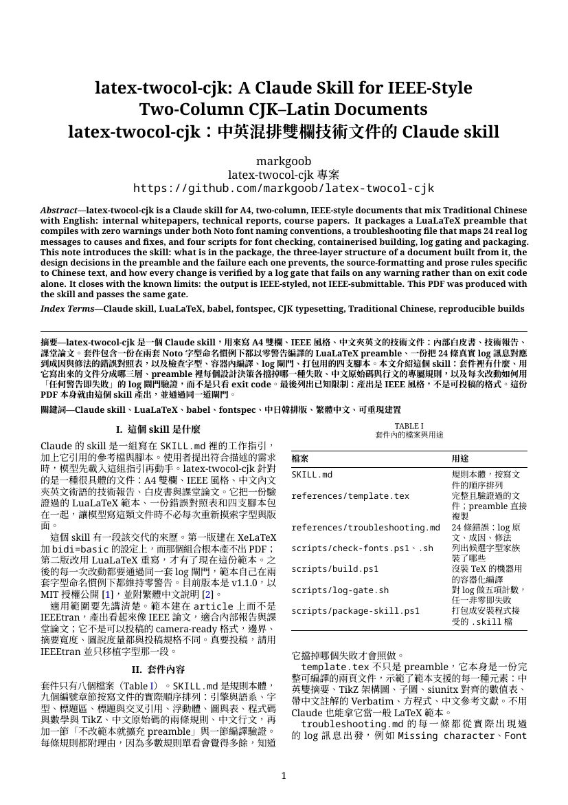
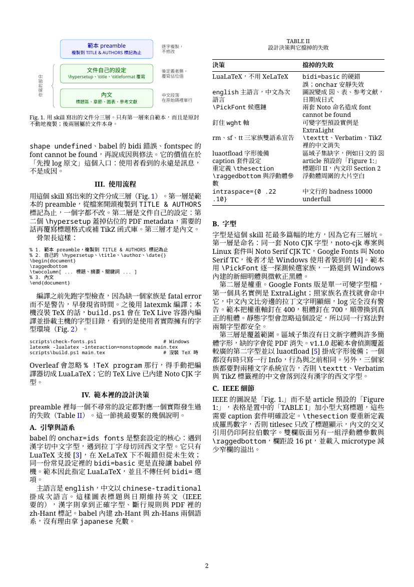
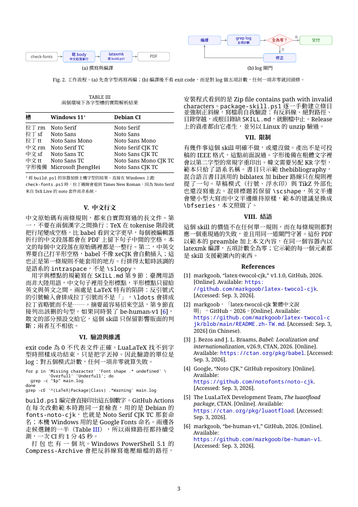

[English](README.md) | **繁體中文**

# latex-twocol-cjk

一個 Claude skill，用來寫 A4 雙欄、IEEE 風格、CJK 與拉丁文字混排的 LaTeX 文件，內部白皮書、技術報告、課堂論文這類東西都適用。它給 Claude 一份第一次就編得過的 LuaLaTeX preamble，以及文件長大之後還編得過的規則。

會做這個 skill，是因為網路上最常見的那套設定根本編不出檔案。CJK 配 babel 的標準寫法是 `bidi=basic` 加 `onchar=ids fonts` 再搭 XeLaTeX，但這個組合錯了兩次：`bidi=basic` 只有 LuaTeX 支援，babel 會直接報錯停機；`onchar` 同樣只有 LuaTeX 支援，卻是安靜失效，於是整套設定賴以成立的逐字換字型從來沒有真的發生過。

## 它排出來長什麼樣

<p align="center">
  <a href="examples/skill-intro/skill-intro.pdf"></a>
  <a href="examples/skill-intro/skill-intro.pdf"></a>
  <a href="examples/skill-intro/skill-intro.pdf"></a>
</p>

[`examples/skill-intro/skill-intro.pdf`](examples/skill-intro/skill-intro.pdf)：用這個 skill 寫成的三頁介紹文件，中文內文、中英雙摘要、TikZ 圖（含跨欄的雙面板 `figure*`）、三張表，五項 log 計數全為零。點頁面可開啟 PDF，原始碼在 [`examples/skill-intro/`](examples/skill-intro/)。

## 安裝

把 skill 檔案複製到 skill 目錄：

```bash
git clone https://github.com/markgoob/latex-twocol-cjk
mkdir -p ~/.claude/skills/latex-twocol-cjk
cp -r latex-twocol-cjk/{SKILL.md,references,scripts} ~/.claude/skills/latex-twocol-cjk/
```

Windows 的位置是 `C:\Users\<你>\.claude\skills\latex-twocol-cjk\`。skill 會在執行中的 session 立刻註冊，不用重啟。

[Releases](https://github.com/markgoob/latex-twocol-cjk/releases) 頁也放了 `.skill` 檔。安裝程式可以直接吃；想手動解開就把副檔名改成 `.zip`，壓縮檔根目錄就是 skill 資料夾本身。

`references/template.tex` 本身就是一份完整可編譯的文件，所以不用 Claude 也能單獨拿它來排版。

## 編譯

先把 `references/template.tex` 複製成自己專案裡的 `main.tex`，內文寫進去，並保留 `\twocolumn[\begin{@twocolumnfalse} … ]` 那個標題區塊，摘要橫跨兩欄靠的就是它。四個步驟寫在 `SKILL.md` 的 Quick start。然後：

```bash
latexmk -lualatex -interaction=nonstopmode main.tex
```

有兩件事會讓第一次編譯直接失敗，不是只給警告。一是少了字型家族：

```bash
sh scripts/check-fonts.sh   # Linux、macOS（需 fontconfig）、Overleaf、容器
scripts\check-fonts.ps1     # Windows
```

二是 TeX Live 裝得太精簡。範本會載入小型方案沒有的套件，`balance.sty` 在 `preprint` 裡，`subcaption` 在 `caption` 裡，對應的錯誤是 `references/troubleshooting.md` 的 E16：

```bash
tlmgr install preprint titlesec placeins xurl multirow caption
```

本機沒裝 TeX 的話，`scripts/build.ps1 main.tex` 會在 TeX Live 容器裡編譯，並且掛載本機字型，所以看到的是真實的字型環境，不是一套通用的 Linux 環境。

Overleaf 會忽略 `% !TeX program` 那行，要自己到 Menu → Compiler 選 LuaLaTeX。Noto CJK 字型 Overleaf 本身已經內建。

## 它擋掉的三個坑

三個都能在 TeX Live 2026 上重現。

**引擎**。改用 LuaLaTeX 編譯，並且把 `bidi=` 整個拿掉。純左至右的中英文件用不到雙向文字演算法。

**語系**。babel 有 `chinese-traditional`（zh-Hant）和 `chinese-simplified`（zh-Hans）。改用 `japanese` 語系的話，圖說會變成「図」、表格變成「表」、參考文獻變成「参考文献」，日期也是日式格式。對中文文件來說這既是語言錯誤，字形也錯，繁體該是「圖」和「參考文獻」。範本讓 `english` 當主語言，把中文語系掛成次語言，於是圖表標題與日期維持英文（IEEE 要的），中文照樣拿到正確字型、正確斷行，以及 PDF 裡正確的 `zh-Hant` 語言標記。繁體是驗證過的預設值。文件真的是別的語言時，要把 preamble 裡每一處 `chinese-traditional` 都換成 `chinese-simplified`、`japanese` 或 `korean`（`\babelprovide` 一處、`\babelcharproperty` 兩行、`\babelfont` 三行），不是只改一行；韓文另外要一套 KR 字型，因為它斷行是斷在空格而不是字元之間。

**字型，而且錯兩次**。同一套字型在不同發行管道叫不同名字。noto-cjk 專案、Linux 套件與 Overleaf 給的是 `Noto Serif CJK TC`，Google Fonts 給的是 `Noto Serif TC`，而後者才是 Windows 使用者實際會裝到的，名字寫死哪一個都會讓 fontspec 直接中止。第二個坑更安靜。Google Fonts 把 Noto TC 做成單一可變字型檔，它第一個具名實例的樣式叫 `ExtraLight,Regular`，權重只有 40，照家族名查找就會命中這個實例，於是中文內文被排成 ExtraLight，明顯比旁邊的拉丁文字細，而且不產生任何警告。

命名的問題交給 `\PickFont`，它逐一探測候選家族，一路退到 Windows 內建的新細明體與微軟正黑體。權重則直接釘死軸：

```latex
UprightFeatures = {RawFeature={axis={wght=400}}},
BoldFont = {*}, BoldFeatures = {RawFeature={axis={wght=700}}},
```

釘軸還順帶換來真正的粗體，不是描邊假粗。靜態字型會安靜地忽略這個設定，所以同一段寫法對兩類字型都安全。

字型還有兩件事值得知道。區域子集有覆蓋範圍的洞，Google 的 Noto Serif TC 沒有日文的「図」，而字型缺的字會從 PDF 裡直接消失，只留一行 log；只要機器上裝了覆蓋較廣的字型（完整版 Noto CJK、微軟正黑體），範本會把它掛成 luaotfload 的字形後備，缺字改由它印出來。另一件是 `pdffonts` 看不出軸有沒有釘對，因為子集名稱沿用字型檔的 PostScript name，就算設定正確，報出來的仍然是 `NotoSerifTC-ExtraLight`。要判斷只能量渲染後的墨量。

## 適用範圍

這套建在 `article` 上，不是 `IEEEtran`。產出看起來像 IEEE 論文，拿來寫內部報告或課堂論文很合適，但它**不是**可以投稿的 camera-ready 格式：邊界、摘要寬度、圖說度量都跟真正的 IEEE 規格不同，投稿檢查會擋下來。真要投稿請用 `IEEEtran`，只把字型那一段移植過去。

有兩處是刻意偏離真 IEEE 的，知道理由才好向人解釋：摘要橫跨兩欄，而不是 `IEEEtran` 的單欄寬；內文字型用 Noto Serif 而不是 Times，為的是跟中文字型搭得起來。

## 讀 log

exit code 是 0 不代表文件沒問題。`Missing character` 的意思是有字被丟掉了，而編譯依然算成功。

| 訊息 | 意思 |
|---|---|
| `Missing character` | 字被默默丟出 PDF，字型設定不對 |
| `Font shape … undefined` | 某個字面被替代，中文的粗體或斜體是假的 |
| 參考文獻出現 `Overfull \hbox` | 少了 `\raggedright` 包裹 |
| `Too many unprocessed floats` | 補一個 `\FloatBarrier` |
| `There were undefined references` | 再跑一次就好 |

`references/troubleshooting.md` 收了 24 條錯誤，每條都附實際會出現的 log 片段、成因與修法。

## 中文行文

把中文頁面排對，跟把中文寫好，是兩件事，而後者才是審閱者第一眼會有反應的部分。`SKILL.md` 第 9 節管跟 LaTeX 有交集的那一半：臺灣用語而非大陸用語、全形標點，以及 LaTeX 會偷偷換成拉丁形式的兩個地方（反引號輸入會排成 `“ ”` 而不是「」，`\ldots` 會排成拉丁省略號而不是 ⋯⋯），還有中英交界的半形空格，跟摘要特別容易招來的那種空話。

有兩條原始碼格式的規則比上面這些更早咬人，寫在 `SKILL.md` 第 8 節與 `troubleshooting.md` 的 E17 至 E19：原始碼在兩個漢字之間斷行會印出一個可見的空格，因為 TeX 在 tokenise 階段就把換行變成空格，比 babel 看到文字更早；還有中文的行排得太鬆時，該動的是語系的 `intraspace`，不是 `\sloppy`。

如果同時裝了 [be-human-v1](https://github.com/markgoob/be-human-v1)，散文的部分預設交給它，不必特地呼叫，第 9 節在用詞與標點上讓位；凡是會影響版面怎麼排的判斷仍歸這個 skill。兩者互不相依，各自單獨裝都能用。

## repo 裡有什麼

| 路徑 | 內容 |
|---|---|
| `SKILL.md` | 規則本體，按寫文件的實際順序排列 |
| `references/template.tex` | 完整且驗證過的文件，preamble 直接複製 |
| `references/troubleshooting.md` | 錯誤 → 成因 → 修法 |
| `scripts/check-fonts.ps1`、`.sh` | 列出候選字型家族裝了哪些 |
| `scripts/build.ps1` | 給沒裝 TeX 的機器用的容器化編譯 |
| `scripts/package-skill.ps1` | 打包成安裝程式吃得下的 `.skill` 檔 |
| `scripts/log-gate.sh` | 對 log 做五項計數，任一非零即失敗 |
| `examples/` | 用這個 skill 寫成的完整文件，CI 每次都對著目前的範本重編 |

## 驗證

`references/template.tex` 在 TeX Live 2026（LuaHBTeX 1.24.0）下編譯出兩頁 PDF，`Missing character`、未定義字面、over/underfull box，以及 LaTeX、Package、Class 警告全部為零。兩套字型命名都測過：Windows 11 上的 Google Fonts Noto TC，以及 Debian 的 `fonts-noto-cjk`。

CI 在每次改動範本與範例時重跑同一套檢查，**任何一項警告都會讓 build 失敗**。這樣的嚴格有必要，因為 LuaLaTeX 找不到字型時照樣 exit 0，只是把字默默丟掉，exit code 是綠的什麼也證明不了。看到警告就當成自己弄出來的缺陷處理。

## 授權

MIT，見 `LICENSE`。
